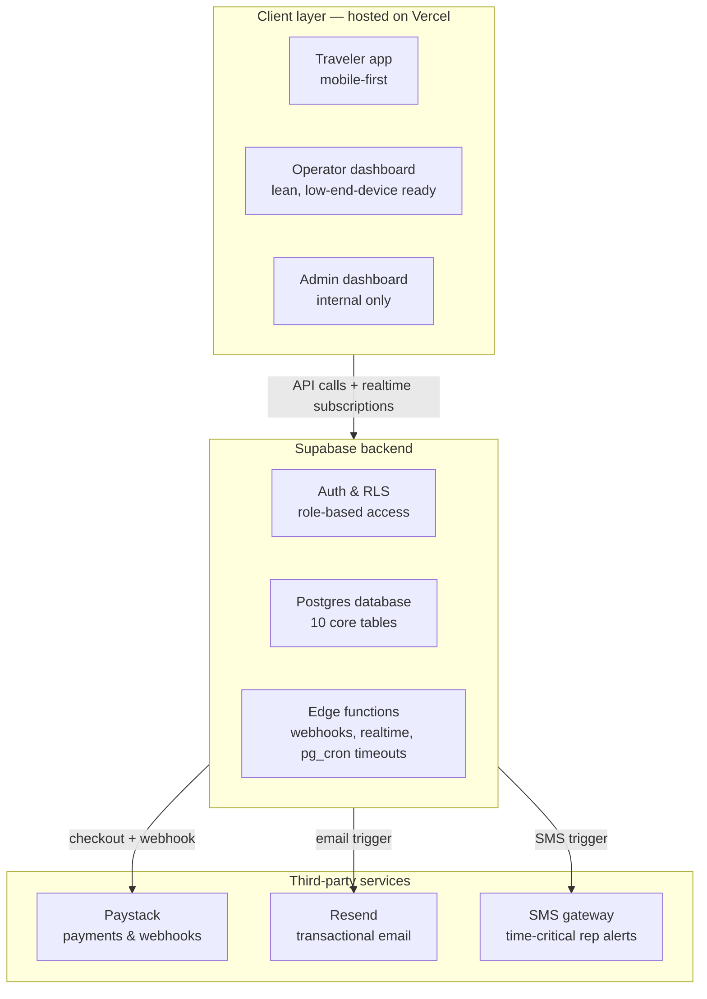
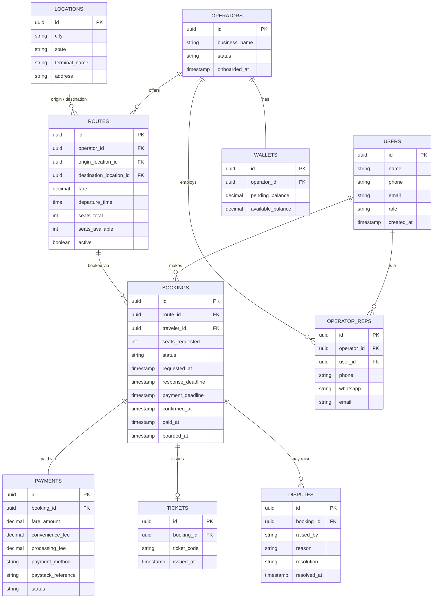
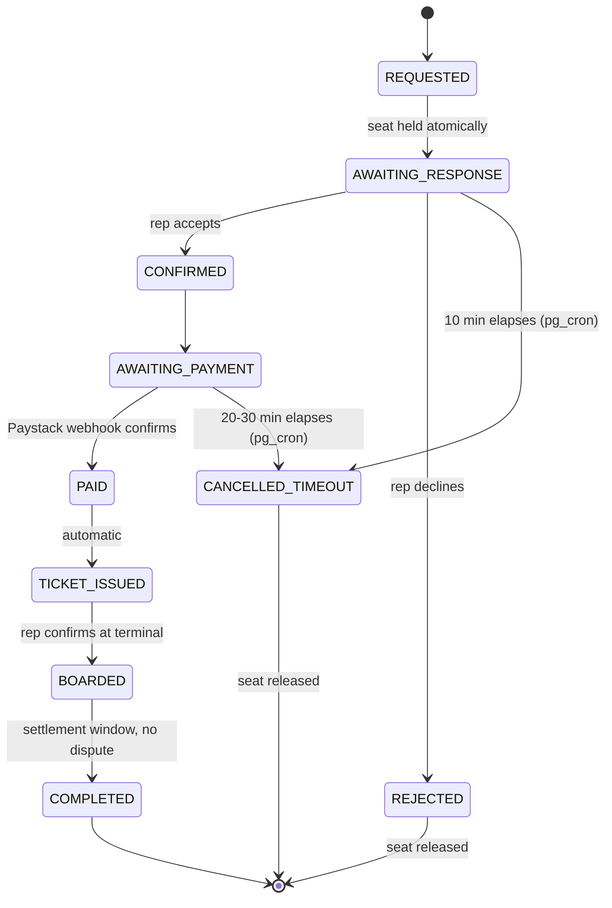

# ArriveLink — Technical Architecture & Build Blueprint

*Companion to the Founder Blueprint (v3) and PRD · Engineering source of truth · July 2026*

This document translates the Founder Blueprint's vision and the PRD's specification into an actual build plan: the system architecture, every technical decision made along the way, the complete database schema, and a phase-by-phase sequence where **each phase ships fully working software before the next one begins.** No phase starts until the previous one is demonstrably functional end to end.

---

## 1. Scope of the MVP

Per the Blueprint and PRD, the MVP proves one thing: **operators will confirm pre-paid reservations through a rep, and travelers will pay before arriving at the terminal.** Everything below exists in service of that one test.

Explicitly out of scope for MVP (per PRD, unchanged):
- Hotels, car rentals, flights/trains, insurance, loyalty programs
- Self-serve operator registration (first cohort onboarded manually)
- Paid verification badges (earned, not purchased)
- Percentage-based or operator-set convenience fees

---

## 2. System architecture

Three layers: a client layer serving three roles, a Supabase backend, and third-party services for payments and notifications.

### 2.1 Tech stack

| Layer | Choice | Why |
|---|---|---|
| Frontend | Next.js (React) + TypeScript + Tailwind CSS | Server components minimize JS shipped to low-end phones; TypeScript catches state-machine and schema errors at compile time; pairs natively with Vercel |
| Backend | Supabase (Postgres, Auth, Realtime, Edge Functions) | One managed backend can safely serve three roles via Row-Level Security; Realtime powers live countdowns without polling |
| Scheduled jobs | Supabase Edge Functions + pg_cron | Server-side enforcement of the 10-min and 20–30-min timeouts — must work with no browser tab open |
| Payments | Paystack (checkout + webhooks) | Nigeria-native, supports card + bank transfer, has a live fee-by-method rate and a Transfers API for later |
| Notifications | Resend (email, all roles) + SMS gateway (rep alerts only, added per your call) + WhatsApp (Meta Cloud API, deferred) | Redundant channels on the one alert where a miss cancels a booking |
| Hosting | Vercel (frontend) + Supabase Cloud (backend) | One deployment, environment-separated (staging + production) |
| Build approach | From scratch, no Lovable.dev scaffolding | Per your call — real code, phase by phase, nothing to unwind later |

Explicitly **not** decided yet, flagged for when we reach that phase: which SMS gateway (Termii vs. Africa's Talking) — both are viable for Nigeria, we'll confirm current pricing/setup when we build Phase 4.

### 2.2 Why this shape

- **Single codebase, three route groups, not three apps.** Matches the Blueprint's "single app, multiple roles" decision. Code-split so the Operator dashboard — which has to run on a low-end Android device with an intermittent connection — never loads Traveler or Admin code.
- **Row-Level Security is the actual security boundary**, not the UI. A traveler's Postgres session literally cannot read another traveler's booking row; a rep's session is scoped to their own operator's routes and bookings. This is what makes one shared backend safe.
- **Edge Functions own anything that must survive a closed browser tab**: the Paystack webhook, and the pg_cron-triggered timeout sweeps. Nothing time-critical depends on client-side JavaScript still running.

---

## 3. Roles & permissions

| Role | Can do |
|---|---|
| Traveler | Search routes, compare operators, submit reservation request, pay, view e-ticket, view booking history |
| Operator Rep | Log in to operator dashboard, manage routes/fares/schedules, accept/reject reservation requests, mark traveler boarded, view wallet/settlement status |
| Admin | Create operator accounts + rep credentials, manage the canonical locations list, view all bookings, resolve disputes, view audit logs, mark payouts settled |

Admin gets a real, purpose-built internal UI (not raw Supabase access) — Supabase remains the backend powering it either way.

---

## 4. Database schema

Ten tables: the PRD's original nine, plus `locations` — added because the PRD didn't specify how operators select origin/destination, and free-text entry would break search reliability. Operators pick from this canonical list rather than typing city names.

---

## 5. Booking state machine

**Seat-hold mechanism (decided this session):** the seat is held the moment a request is submitted, not at confirmation. Implementation: a single Postgres transaction that checks `seats_available >= seats_requested`, decrements it, and inserts the booking row — using a row lock so two simultaneous requests can never both succeed against the last seat. `REJECTED` and `CANCELLED_TIMEOUT` both increment `seats_available` back by the same amount, in the same transactional pattern.

Both timeout transitions are enforced by Supabase Edge Functions on a pg_cron schedule (checking every minute for expired deadlines) — never client-side, so an abandoned browser tab can't hold a seat indefinitely.

---

## 6. Notifications

| Event | Recipient | Channel |
|---|---|---|
| New reservation request | Operator rep | Email **and** SMS, fired together (added this session — the 10-minute SLA is too tight to risk an unread email on a low-end device) |
| Reservation confirmed | Traveler | Email |
| Payment deadline approaching | Traveler | Email |
| E-ticket issued | Traveler | Email |

WhatsApp (Meta Cloud API) is deferred until volume justifies the cost, per the Blueprint — same trigger points as email, added later without changing the underlying event system.

---

## 7. Payment flow

1. Payment is only requested once a booking reaches `CONFIRMED` — never before.
2. Checkout shows three separate line items: fare subtotal, convenience fee (₦200 fixed, identical regardless of method), and processing fee (calculated at Paystack's live rate for the chosen method) — plus a total.
3. Paystack webhook confirmation is the *only* trigger that moves a booking to `PAID` — never a client-side confirmation.
4. `PAID → TICKET_ISSUED` happens automatically in the same webhook handler — no manual step.
5. If the 20–30 minute window elapses unpaid, the booking moves to `CANCELLED_TIMEOUT` and the seat returns to `seats_available`.

**Payouts (decided this session):** manual settlement for MVP. Admin transfers to the operator's bank off-platform and marks the wallet balance as settled in the system. Paystack's Transfers API remains an option once volume justifies automating it — not needed for a 2–3 operator pilot.

---

## 8. Non-functional requirements

- Timeout enforcement is server-side and reliable with zero clients connected.
- Seat count updates are atomic — no two simultaneous requests can claim the same seat.
- Every payment status change is driven by a Paystack webhook event, never client-side confirmation.
- The operator dashboard must be usable on a low-end Android device on an intermittent connection — this is the rep's primary device in most cases. Built as its own lean, code-split bundle.
- The traveler app is mobile-first and optimized throughout — most users are on their phones. Concrete practices: server components to minimize shipped JS, optimized images, real-device testing on common Nigerian Android hardware and throttled connections, and a PWA-installable shell.

---

## 9. Decisions log

A running record of calls made in this planning conversation, so the reasoning doesn't get lost:

| Decision | Choice | Rationale |
|---|---|---|
| Seat hold timing | At request time, not confirmation | Only way to guarantee the atomicity the NFRs require |
| Rep alert channel | Email + SMS together | 10-min SLA is too tight to trust to email alone on a low-end device |
| Scaffolding | Build from scratch, no Lovable.dev | Matches the "fully functional at every stage" build philosophy — nothing generated to unwind later |
| Admin | Real internal UI, Supabase-backed | Confirmed as a genuine product surface, not just DB access, while still internal-only |
| Origin/destination entry | Canonical `locations` list, not free text | Keeps search matching reliable |
| Operator payouts | Manual settlement for MVP | Right-sized for a 2–3 operator pilot; automate later via Paystack Transfers if needed |
| Platform | Responsive web app, mobile-first | No native app in the stack or PRD; most users are on phones, so this is the primary design target, not an afterthought |
| Behavior vs. brand authority | Blueprint + PRD govern function; Brand Kit governs look/voice | Resolves the one mockup/PRD mismatch found (₦200 "unlock rep" vs. convenience fee) in favor of the more detailed technical spec |

---

## 10. Phase-by-phase build plan

Each phase below ends with a **fully functional** system — not a partial feature waiting on the next phase to become real. Loosely, Phases 1–3 correspond to the Blueprint's Phase 0 (weeks 1–2), Phases 4–6 to its Phase 1 (week 3), and Phases 7–8 to its Phase 2 (week 4) — though "fully functional before moving on" may run a bit longer than the compressed weekly estimate, which is the point of building it this way.

### Phase 1 — Foundation, schema & auth
**Builds:** Next.js + TypeScript project from scratch; Supabase project with all 10 tables and RLS policies for all three roles; auth flows for Traveler, Operator Rep, and Admin; role-based routing shell for all three surfaces; Git repo, staging + production Supabase projects, Vercel deployment pipeline.
**Fully functional when:** a traveler can sign up and log in; Admin can log in and create an operator + rep account; the rep can log in; every role lands on its correct (even if largely empty) dashboard on a live URL.

### Phase 2 — Admin & operator setup
**Builds:** Admin dashboard for creating operator accounts and rep credentials, and managing the canonical locations list; operator dashboard for route/fare/schedule management (add, edit, deactivate), built against that locations list.
**Fully functional when:** Admin creates a real operator (e.g., GIG Motors) with a working rep login; the rep logs in and creates a real route (e.g., Benin City → Port Harcourt) with fare, schedule, and seat count, correctly stored.

### Phase 3 — Traveler search & comparison
**Builds:** Search screen (origin, destination from the canonical list, date); results/comparison screen listing matching operators with price, departure times, and seats available.
**Fully functional when:** a traveler searches Benin City → Port Harcourt and sees the exact route created in Phase 2, correctly.

### Phase 4 — Reservation engine
**Builds:** Reservation request screen; the atomic seat-hold transaction; notification fan-out to the rep (email + SMS together) with the 10-minute deadline; awaiting-response screen with a live countdown via Supabase Realtime; operator dashboard incoming-requests queue with live per-request countdowns; accept/reject actions; the pg_cron job checking every minute for expired requests, auto-cancelling and releasing the seat.
**Fully functional when:** a traveler requests a seat and the count drops immediately; the rep receives both email and SMS; the rep can accept or reject in real time from the dashboard; an unanswered request auto-cancels at 10 minutes and the seat count restores correctly.

### Phase 5 — Payments
**Builds:** Payment screen with the three-line breakdown and live 20–30 minute countdown; Paystack checkout integration; the webhook handler as a Supabase Edge Function; automatic `PAID → TICKET_ISSUED` transition with ticket code generation; the payment-timeout extension of the pg_cron job.
**Fully functional when:** a confirmed booking shows the correct payment breakdown; a Paystack test-mode payment completes, the webhook fires, and the booking becomes `PAID` then `TICKET_ISSUED` automatically; an unpaid booking cancels correctly at the deadline and releases the seat.

### Phase 6 — E-ticket, boarding & history
**Builds:** E-ticket screen with booking ID, route, departure time, operator, and a QR/code; traveler booking history/status screen; operator dashboard's active-bookings list and boarding confirmation (search by booking ID or name, mark boarded).
**Fully functional when:** a traveler can view a real e-ticket with a working code; a rep can search for and mark that traveler boarded, and both sides see the status update live.

### Phase 7 — Settlement, wallet & disputes
**Builds:** Automatic `BOARDED → COMPLETED` transition after the settlement window passes with no dispute; operator wallet view (pending/available balance); Admin's manual "mark as settled" action for payouts; a basic dispute flow — raise, view queue, resolve, with an audit trail.
**Fully functional when:** a completed trip's funds appear correctly in the operator's available balance; Admin can mark it settled; a raised dispute appears in Admin's queue and can be resolved end to end.

### Phase 8 — Mobile hardening & launch readiness
**Builds:** a dedicated mobile-optimization pass across every traveler-facing screen (asset optimization, minimal client JS, real-device testing on common Nigerian Android hardware and throttled connections, installable PWA shell); concurrency/load testing specifically on the seat-hold logic; idempotency handling on the Paystack webhook; a full end-to-end run of the entire journey — search → reserve → accept → pay → ticket → board → settle — with real test operators.
**Fully functional when:** the complete flow works end to end on an actual low-end Android device under a throttled connection. This is the gate before the Blueprint's own soft launch (its Phase 3, week 5).

---

*Next step: confirm this plan, then begin Phase 1.*
